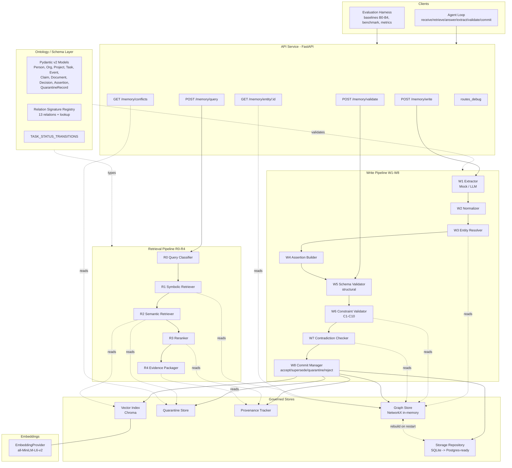
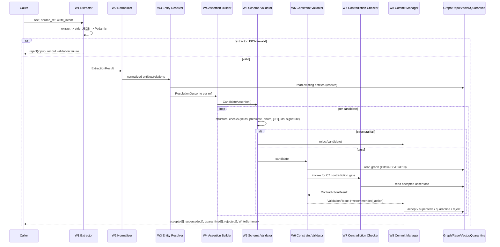
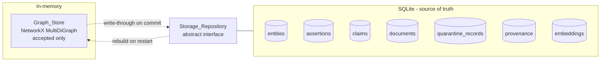
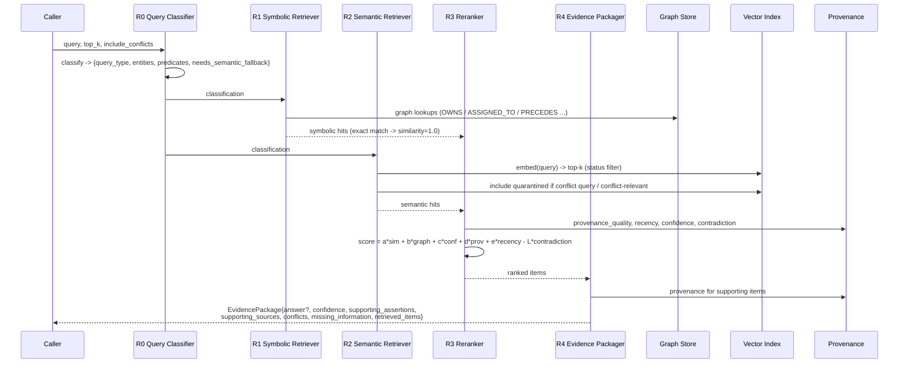
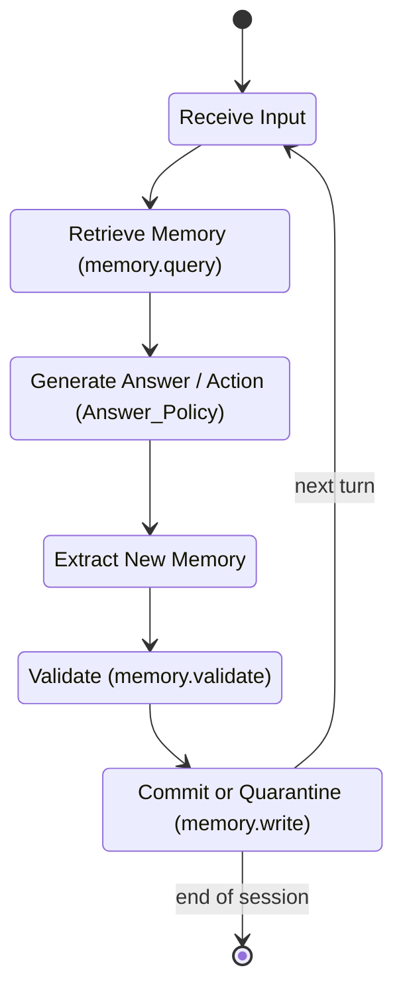

# Design Document: Ontology-Constrained Memory (OCM)

## Overview

Ontology-Constrained Memory (OCM) is a reusable, pluggable memory module for long-horizon LLM agents. Its central research claim is that **agent memory should be governed at write time** rather than cleaned up at read time. Concretely, OCM converts unstructured input into **typed graph assertions**, validates those assertions against an **ontology and a set of constraint rules**, runs every candidate through a **contradiction gate** before commit, and attaches **provenance** to everything it accepts. Only after a candidate survives write-time governance does it become "accepted memory". Retrieval is then a **hybrid symbolic-semantic** process that returns an *evidence package* (answer, supporting assertions, provenance, and unresolved conflicts) rather than a raw blob of text.

The hypothesis is that this write-time governance reduces memory-induced hallucination, surfaces contradictions instead of silently overwriting them, and improves long-horizon plan consistency relative to a vector-only memory baseline.

Key design stances:

- **Pluggable module, not an application.** OCM exposes a Python API and a thin FastAPI surface. It does not own a UI, authentication, or multi-user permissions. It lives under an `ocm/` package and is intended to be embedded in an agent framework.
- **Offline-first by default.** With no configuration, OCM runs fully offline: a deterministic `Mock_Extractor` (no API key, no network) and a local `sentence-transformers/all-MiniLM-L6-v2` embedding model. A real OpenAI-compatible `LLM_Extractor` is opt-in.
- **Deterministic and reproducible.** A `deterministic_test_mode` flag produces stable IDs derived from entity type, normalized name, source_ref, and seeded counters so tests, benchmarks, and ablations are reproducible.
- **Backend-swappable.** Persistence sits behind a `Storage_Repository` interface (SQLite now, Postgres-ready). Embeddings sit behind an `EmbeddingProvider` interface. Extraction sits behind an `Extractor` interface.
- **Governance is observable.** Every write and query emits structured research logs, and the system ships with baselines (B0–B4), a seeded benchmark generator, and a metrics reporter so the research claim can be measured via ablation.

This document specifies the full architecture, the write pipeline (W1–W8), storage, embeddings, the retrieval pipeline (R0–R4), the API, agent integration, evaluation harness, correctness properties for property-based testing, error handling, and a testing strategy, and closes with a mapping from each component to the requirements it satisfies.

## Architecture

OCM is organized as a layered pipeline. Unstructured input flows left-to-right through the **Write Pipeline** into the governed stores; queries flow through the **Retrieval Pipeline** out of those stores into evidence packages. The **Ontology/Schema layer** is shared by both pipelines. The **API service** and the **Agent loop** are thin clients of the core. The **Evaluation harness** drives the whole system through configurable baselines.



### Package Layout to Component Mapping

The implementation lives under `ocm/`. Each module maps to architecture components:

| Package path | Components | Responsibility |
|---|---|---|
| `ocm/app/api/` | API Service | FastAPI app, routers for the 5 endpoints + `routes_debug`, request/response models, dependency wiring |
| `ocm/core/` | Config, IDs, logging, container | Settings (`deterministic_test_mode`, extractor/embedding selection), ID generation, `Research_Logger`, dependency container |
| `ocm/ontology/` | Ontology/Schema layer | Pydantic v2 entity models, enums, `RELATION_SIGNATURES` registry + lookup, `TASK_STATUS_TRANSITIONS` |
| `ocm/extraction/` | W1 Extractor | `Extractor` interface, `Mock_Extractor`, `LLM_Extractor`, extraction prompt + JSON schema |
| `ocm/resolution/` | W2 Normalizer, W3 Entity Resolver | Normalization rules, conservative resolution + `POSSIBLY_SAME_AS` |
| `ocm/validation/` | W5 Schema Validator, W6 Constraint Validator, W7 Contradiction Checker | Structural validation, C1–C10 validators, contradiction detection |
| `ocm/memory/` | W4 Assertion Builder, W8 Commit Manager, Graph Store, Storage Repository, Quarantine Store, Provenance Tracker | Assertion construction, commit routing, NetworkX graph, SQLite repo, quarantine, provenance |
| `ocm/retrieval/` | R0–R4, EmbeddingProvider, Vector Index | Classifier, symbolic + semantic retrievers, reranker, evidence packager, embeddings, Chroma index |
| `ocm/agent/` | Agent Loop, MemoryTool, Answer Policy | Custom loop, memory tool interface, P1–P5 policy, optional `langgraph_demo` |
| `ocm/evaluation/` | Baselines, Benchmark Generator, Metrics Reporter | B0–B4 strategy objects, seeded benchmark, metrics computation |
| `ocm/tests/` | Test suites | Unit, property-based (Hypothesis), integration, API tests |
| `ocm/scripts/` | Entry points | `run_benchmark.py`, `report_metrics.py`, `serve.py`, `build_benchmark.py` |

## Tech Stack and Decisions

| Choice | Decision | Rationale |
|---|---|---|
| Language/runtime | **Python 3.11+** | Required by spec; 3.11 gives faster startup, `tomllib`, better typing (`Self`, exception groups) used in pipeline error aggregation. |
| Web framework | **FastAPI** | Required by spec; native Pydantic v2 integration means request/response models *are* the ontology models, eliminating a translation layer. Auto OpenAPI docs aid the research/demo story. |
| Data modeling/validation | **Pydantic v2** | Required by spec; provides the strict typed models that make "schema validation" (W5) and enum rejection (Req 1.11) free. v2's `model_validate`/`model_dump` give the round-trip property a clean implementation. |
| Graph store | **NetworkX (in-memory `MultiDiGraph`)** | Required by spec; directed multigraph matches typed assertions (multiple predicates between same nodes). Built-in `simple_cycles`/`has_path` give C3 acyclic-PRECEDES detection without custom graph code. In-memory keeps symbolic retrieval fast; rebuilt from SQLite on restart. |
| Relational persistence | **SQLite behind `Storage_Repository`** | Required by spec; zero-config, file-based, perfect for a research prototype. The repository interface isolates SQL so a Postgres adapter is a drop-in. |
| Vector store | **Chroma (local persistence; in-memory for tests)** | Required by spec; local persistence keeps the system offline-first; an in-memory client mode makes tests fast and hermetic (Req 13.6). |
| Embeddings | **sentence-transformers/all-MiniLM-L6-v2 behind `EmbeddingProvider`** | Required by spec; small (384-dim), fast, runs locally with no network. The interface allows swapping to a hosted model later without touching retrieval code. |
| Extraction | **Deterministic `Mock_Extractor` default; opt-in OpenAI-compatible `LLM_Extractor`** | Required by spec; deterministic mock makes the whole pipeline reproducible and CI-friendly with no API key. LLM extractor is config-gated so real extraction is available when desired. |
| Determinism | **`deterministic_test_mode`** | Required by spec; reproducible IDs make benchmarks, ablations, and property tests stable across runs. |
| Testing | **pytest + Hypothesis** | Required by spec for unit/integration; Hypothesis supplies property-based testing for the correctness properties (round-trips, invariants, contradiction gate). |

### Configuration Model

`ocm/core/config.py` defines a Pydantic `Settings` object (env + optional file override):

```python
class Settings(BaseModel):
    extractor: Literal["mock", "llm"] = "mock"
    llm_base_url: str | None = None
    llm_api_key: str | None = None
    llm_model: str = "gpt-4o-mini"
    embedding_model: str = "sentence-transformers/all-MiniLM-L6-v2"
    embedding_mode: Literal["local"] = "local"
    sqlite_path: str = "ocm.db"
    chroma_mode: Literal["persistent", "memory"] = "persistent"
    chroma_path: str = ".chroma"
    deterministic_test_mode: bool = False
    rerank_weights: RerankWeights = RerankWeights()  # defaults below
    contradiction_high_confidence: float = 0.8
    decision_evidence_floor: int = 1
```

With no configuration supplied the defaults select the Mock_Extractor and local embeddings, satisfying the offline-first requirement (Req 27.2).

## Ontology Layer

The ontology layer (`ocm/ontology/`) is the single source of truth for memory structure. It contains: (1) enum definitions, (2) Pydantic v2 entity/assertion models, (3) the `RELATION_SIGNATURES` registry with a lookup API, and (4) the `TASK_STATUS_TRANSITIONS` map.

### Enumerations

All status/priority/severity/intent fields are `str` enums so out-of-enum values raise `ValidationError` (Req 1.11). Every status enum includes `unknown` to support default-to-unknown behavior (Req 1.13).

```python
class PersonStatus(str, Enum):        active="active"; inactive="inactive"; unknown="unknown"
class OrgStatus(str, Enum):           active="active"; inactive="inactive"; unknown="unknown"
class ProjectStatus(str, Enum):       active="active"; inactive="inactive"; completed="completed"; cancelled="cancelled"; unknown="unknown"
class TaskStatus(str, Enum):          todo="todo"; in_progress="in_progress"; blocked="blocked"; done="done"; cancelled="cancelled"; unknown="unknown"
class Priority(str, Enum):            low="low"; medium="medium"; high="high"; urgent="urgent"; unknown="unknown"
class ClaimStatus(str, Enum):         accepted="accepted"; rejected="rejected"; quarantined="quarantined"; superseded="superseded"; unknown="unknown"
class DecisionStatus(str, Enum):      draft="draft"; final="final"; superseded="superseded"; rejected="rejected"; unknown="unknown"
class AssertionStatus(str, Enum):     accepted="accepted"; rejected="rejected"; quarantined="quarantined"; superseded="superseded"; unknown="unknown"
class WriteIntent(str, Enum):         new_fact="new_fact"; update="update"; correction="correction"; deletion="deletion"; hypothesis="hypothesis"
class Severity(str, Enum):            low="low"; medium="medium"; high="high"
class QuarantineStatus(str, Enum):    unresolved="unresolved"; resolved="resolved"; dismissed="dismissed"
class ResolutionStatus(str, Enum):    resolved_existing="resolved_existing"; created_new="created_new"; possible_match="possible_match"; unresolved="unresolved"
```

### Status Defaulting and Metadata

A shared mixin implements default-to-`unknown` and records that the value was defaulted (Req 1.13, 1.15). `Event` and `Document` do **not** use this mixin and have no status field (Req 1.14).

```python
class StatusDefaultMixin(BaseModel):
    status_defaulted: bool = Field(default=False, exclude=False)

    @model_validator(mode="before")
    @classmethod
    def _default_status(cls, data):
        if isinstance(data, dict) and ("status" not in data or data.get("status") is None):
            data = {**data, "status": "unknown", "status_defaulted": True}
        return data
```

`status_defaulted` is the "WHERE metadata is available" record (Req 1.15). It is persisted alongside the entity.

### Entity and Assertion Models

All models share `id: str` and (where applicable) created/updated metadata. Confidence fields use `confloat(ge=0.0, le=1.0)` so the [0,1] bound is enforced structurally (Req 1.6, 1.9; supports C6).

```python
class Person(StatusDefaultMixin):
    id: str
    name: str
    roles: list[str] = []
    status: PersonStatus = PersonStatus.unknown
    aliases: list[str] = []

class Organization(StatusDefaultMixin):
    id: str
    name: str
    type: str
    status: OrgStatus = OrgStatus.unknown

class Project(StatusDefaultMixin):
    id: str
    name: str
    goal: str | None = None
    status: ProjectStatus = ProjectStatus.unknown
    owner_id: str | None = None

class Task(StatusDefaultMixin):
    id: str
    title: str
    status: TaskStatus = TaskStatus.unknown
    priority: Priority = Priority.unknown
    project_id: str | None = None
    assignee_id: str | None = None
    due_at: datetime | None = None

class Event(BaseModel):                      # no status field (Req 1.14)
    id: str
    type: str
    timestamp_start: datetime
    timestamp_end: datetime | None = None
    description: str

class Claim(StatusDefaultMixin):
    id: str
    text: str
    source_ref: str
    confidence: confloat(ge=0.0, le=1.0)
    status: ClaimStatus = ClaimStatus.unknown
    created_at: datetime

class Document(BaseModel):                    # no status field (Req 1.14)
    id: str
    title: str
    path_or_url: str
    created_at: datetime
    tags: list[str] = []

class Decision(StatusDefaultMixin):
    id: str
    summary: str
    timestamp: datetime
    made_by: str | None = None
    rationale: str | None = None
    status: DecisionStatus = DecisionStatus.unknown

class Assertion(StatusDefaultMixin):
    id: str
    subject_id: str
    predicate: str
    object_id: str
    confidence: confloat(ge=0.0, le=1.0)
    status: AssertionStatus = AssertionStatus.unknown
    source_ref: str
    created_at: datetime
    valid_from: datetime | None = None
    valid_to: datetime | None = None
    extractor_version: str | None = None
    write_intent: WriteIntent = WriteIntent.new_fact

class QuarantineRecord(BaseModel):
    id: str
    candidate_payload: dict           # serialized candidate assertion/entity
    reason: str
    severity: Severity
    conflicting_ids: list[str] = []
    created_at: datetime
    status: QuarantineStatus = QuarantineStatus.unresolved
```

`Provenance` is modeled separately and linked by `subject_id` (the assertion/claim/document/quarantine id):

```python
class Provenance(BaseModel):
    id: str
    subject_id: str                   # id of the assertion/claim/document/quarantine record
    source_ref: str
    created_at: datetime
    extractor_version: str | None = None
    supporting_evidence_ids: list[str] = []
```

### Relation Signature Registry

`RELATION_SIGNATURES` is a frozen registry mapping each predicate to its directed signature. Source/target types are sets of entity-type names; cardinality is an enum. All 13 relations from Req 2 (including the new `SUPERSEDES`) are declared.

```python
class Cardinality(str, Enum):
    ONE_TO_ONE="1:1"; ONE_TO_N="1:n"; M_TO_ONE="m:1"; M_TO_N="m:n"

@dataclass(frozen=True)
class RelationSignature:
    predicate: str
    source_types: frozenset[str]
    target_types: frozenset[str]
    cardinality: Cardinality

RELATION_SIGNATURES: dict[str, RelationSignature] = {
    "PARTICIPATES_IN": RelationSignature("PARTICIPATES_IN", {"Person"}, {"Event"}, Cardinality.M_TO_N),
    "MEMBER_OF":       RelationSignature("MEMBER_OF", {"Person"}, {"Organization"}, Cardinality.M_TO_N),
    "OWNS":            RelationSignature("OWNS", {"Person","Organization"}, {"Project"}, Cardinality.M_TO_N),
    "CONTAINS":        RelationSignature("CONTAINS", {"Project"}, {"Task"}, Cardinality.ONE_TO_N),
    "ASSIGNED_TO":     RelationSignature("ASSIGNED_TO", {"Task"}, {"Person"}, Cardinality.M_TO_ONE),
    "PRECEDES":        RelationSignature("PRECEDES", {"Event"}, {"Event"}, Cardinality.M_TO_N),
    "SUPPORTS":        RelationSignature("SUPPORTS", {"Claim"}, {"Claim","Decision"}, Cardinality.M_TO_N),
    "CONTRADICTS":     RelationSignature("CONTRADICTS", {"Claim","Assertion"}, {"Claim","Assertion"}, Cardinality.M_TO_N),
    "EVIDENCE_FOR":    RelationSignature("EVIDENCE_FOR", {"Document","Event"}, {"Claim","Decision","Assertion"}, Cardinality.M_TO_N),
    "RESULTS_IN":      RelationSignature("RESULTS_IN", {"Event","Decision"}, {"Event","Task","Project"}, Cardinality.M_TO_N),
    "ABOUT":           RelationSignature("ABOUT", {"Document","Claim"}, {"Person","Project","Task","Event","Decision"}, Cardinality.M_TO_N),
    "POSSIBLY_SAME_AS":RelationSignature("POSSIBLY_SAME_AS", {"Person","Organization","Project","Task","Event"}, {"Person","Organization","Project","Task","Event"}, Cardinality.M_TO_N),
    "SUPERSEDES":      RelationSignature("SUPERSEDES", {"Assertion"}, {"Assertion"}, Cardinality.M_TO_N),
}

def get_relation_signature(predicate: str) -> RelationSignature:
    """Registry lookup API (Req 2.14). Raises UnknownPredicateError if not registered."""
    try:
        return RELATION_SIGNATURES[predicate]
    except KeyError:
        raise UnknownPredicateError(predicate)
```

The lookup returns declared source types, target types, and cardinality (Req 2.14). `Schema_Validator` uses it for structural checks (W5); `Constraint_Validator` C9 uses it for graph-level domain/range against resolved entity types.

### Task Status Transition Map

```python
TASK_STATUS_TRANSITIONS: dict[TaskStatus, set[TaskStatus]] = {
    TaskStatus.todo:        {TaskStatus.in_progress, TaskStatus.blocked, TaskStatus.cancelled},
    TaskStatus.in_progress: {TaskStatus.blocked, TaskStatus.done, TaskStatus.cancelled},
    TaskStatus.blocked:     {TaskStatus.in_progress, TaskStatus.cancelled},
    TaskStatus.done:        set(),
    TaskStatus.cancelled:   set(),
}
```

This map drives constraint C10 (Req 8.11). A `correction` write_intent bypasses the transition check.

## Components and Interfaces

This section indexes the system's components and their primary interfaces. Each interface is specified in full in the pipeline, storage, retrieval, API, and agent sections that follow; the table below is the at-a-glance contract surface.

| Component | Package | Primary interface | Detailed in |
|---|---|---|---|
| Extractor (W1) | `ocm/extraction/` | `Extractor.extract(text, source_ref) -> ExtractionResult` | Write Pipeline → W1 |
| Normalizer (W2) | `ocm/resolution/` | `Normalizer.normalize(ExtractionResult) -> ExtractionResult` | Write Pipeline → W2 |
| Entity Resolver (W3) | `ocm/resolution/` | `EntityResolver.resolve(entity_ref, graph) -> ResolutionOutcome` | Write Pipeline → W3 |
| Assertion Builder (W4) | `ocm/memory/` | `AssertionBuilder.build(relation, resolved) -> CandidateAssertion` | Write Pipeline → W4 |
| Schema Validator (W5) | `ocm/validation/` | `SchemaValidator.validate(c, graph) -> ValidationResult` | Write Pipeline → W5 |
| Constraint Validator (W6) | `ocm/validation/` | `ConstraintValidator.validate(c, graph, checker) -> ValidationResult` | Write Pipeline → W6 |
| Contradiction Checker (W7) | `ocm/validation/` | `ContradictionChecker.check(c, graph) -> ContradictionResult` | Write Pipeline → W7 |
| Commit Manager (W8) | `ocm/memory/` | `CommitManager.commit(c, vr) -> WriteOutcome` | Write Pipeline → W8 |
| Storage Repository | `ocm/memory/` | `StorageRepository` ABC (entities/assertions/claims/documents/quarantine/provenance/embeddings) | Storage Design |
| Graph Store | `ocm/memory/` | `GraphStore` (NetworkX MultiDiGraph; `rebuild_graph`) | Storage Design |
| Quarantine Store | `ocm/memory/` | `QuarantineStore.add/list/set_status` | Storage Design |
| Provenance Tracker | `ocm/memory/` | `ProvenanceTracker.record/for_subject` | Storage Design |
| EmbeddingProvider | `ocm/retrieval/` | `EmbeddingProvider.embed/embed_one` | Embeddings and Vector Index |
| Vector Index | `ocm/retrieval/` | `VectorIndex.add/query` (Chroma) | Embeddings and Vector Index |
| Query Classifier (R0) | `ocm/retrieval/` | `QueryClassifier.classify(query) -> QueryClassification` | Retrieval Pipeline → R0 |
| Symbolic Retriever (R1) | `ocm/retrieval/` | `SymbolicRetriever.retrieve(cls, graph) -> list[SymbolicHit]` | Retrieval Pipeline → R1 |
| Semantic Retriever (R2) | `ocm/retrieval/` | `SemanticRetriever.retrieve(query, cls, top_k) -> list[SemanticHit]` | Retrieval Pipeline → R2 |
| Reranker (R3) | `ocm/retrieval/` | `Reranker.rerank(symbolic, semantic, weights) -> list[RankedItem]` | Retrieval Pipeline → R3 |
| Evidence Packager (R4) | `ocm/retrieval/` | `EvidencePackager.package(query, cls, ranked) -> EvidencePackage` | Retrieval Pipeline → R4 |
| API Service | `ocm/app/api/` | FastAPI routers for 5 endpoints + `routes_debug` | API Design |
| Agent Loop / MemoryTool | `ocm/agent/` | `MemoryTool.query/write`; loop nodes | Agent Integration |
| Answer Policy | `ocm/agent/` | `AnswerPolicy.render(pkg, high_stakes) -> str` | Agent Integration |
| Baselines / Benchmark / Metrics / Logger | `ocm/evaluation/` | `MemoryStrategy`, `Benchmark_Generator`, `Metrics_Reporter`, `Research_Logger` | Baselines and Evaluation Harness |

## Data Models

Beyond the persisted ontology models, the pipeline stages exchange these typed contracts (Pydantic models in `ocm/memory/contracts.py`). They make the candidate → result → outcome flow explicit.

```python
class ExtractionResult(BaseModel):
    entities: list[dict]          # raw typed dicts validated into entity models downstream
    events: list[dict]
    claims: list[dict]
    documents: list[dict]
    decisions: list[dict]
    relations: list[dict]         # {subject, predicate, object, confidence, write_intent?}
    extractor_version: str

class ResolutionOutcome(BaseModel):
    resolution_status: ResolutionStatus
    entity_id: str | None
    candidate_matches: list[str] = []

class CandidateAssertion(BaseModel):
    operation: Literal["upsert_assertion"] = "upsert_assertion"
    subject_id: str
    predicate: str
    object_id: str
    confidence: confloat(ge=0.0, le=1.0)
    source_ref: str
    write_intent: WriteIntent = WriteIntent.new_fact
    valid_from: datetime | None = None
    valid_to: datetime | None = None
    extractor_version: str | None = None

class ValidationResult(BaseModel):
    valid: bool
    failed_check: str | None = None        # which schema/constraint failed
    reason: str | None = None
    severity: Severity | None = None
    conflicting_ids: list[str] = []
    recommended_action: Literal["accept","quarantine","reject","supersede"] | None = None

class ContradictionResult(BaseModel):
    has_conflict: bool
    severity: Severity | None = None
    reason: str | None = None
    conflicting_assertion_ids: list[str] = []
    kind: Literal["hard","soft","temporal"] | None = None
    recommended_action: Literal["accept","quarantine","supersede"] | None = None

class WriteOutcome(BaseModel):
    candidate: CandidateAssertion
    decision: Literal["accepted","superseded","quarantined","rejected"]
    assertion_id: str | None = None
    quarantine_id: str | None = None
    superseded_assertion_id: str | None = None
    reason: str | None = None

class WriteSummary(BaseModel):
    num_candidates: int
    num_accepted: int
    num_quarantined: int
    num_rejected: int
    num_superseded: int
```

## Write Pipeline Design (W1–W8)

The write pipeline (`POST /memory/write` → `WritePipeline.run(text, source_ref, write_intent, extractor_version)`) is a strict ordered sequence. Each stage is an injectable component with a narrow interface. A failure at any stage routes the candidate to reject or quarantine rather than aborting the whole batch — each candidate assertion is processed independently through W5–W8 so one bad candidate does not block good ones.



### W1 — Extractor

Interface:

```python
class Extractor(Protocol):
    version: str
    def extract(self, text: str, source_ref: str) -> ExtractionResult: ...
```

Two implementations:

- **`Mock_Extractor` (default).** Deterministic, offline, no API key (Req 3.4, 3.5, 3.7). It applies a set of seeded regex/keyword rules to produce a stable `ExtractionResult` for a given (text, config). Identical input + identical config ⇒ byte-identical output. Used as default when no extractor config is provided.
- **`LLM_Extractor` (opt-in).** Enabled by `settings.extractor == "llm"` (Req 3.6). Calls an OpenAI-compatible chat endpoint with a JSON-mode prompt, then validates the returned JSON into `ExtractionResult`.

Both return **strict JSON validated by Pydantic** (Req 3.2). If validation fails, the pipeline rejects the input and records a validation failure (Req 3.3).

Extraction prompt (LLM_Extractor):

```
SYSTEM: You are an information extraction engine for an ontology-constrained memory.
Extract entities, events, claims, documents, decisions, and relations from the input.
Return ONLY valid JSON matching this schema (no prose):
{
  "entities":  [{"type": "Person|Organization|Project|Task|...", "name": "...", "fields": {...}}],
  "events":    [{"type":"...","timestamp_start":"ISO8601","timestamp_end":"ISO8601|null","description":"..."}],
  "claims":    [{"text":"...","confidence":0.0-1.0}],
  "documents": [{"title":"...","path_or_url":"...","tags":[]}],
  "decisions": [{"summary":"...","timestamp":"ISO8601","made_by":"...|null","status":"draft|final|..."}],
  "relations": [{"subject":"<name|id>","predicate":"OWNS|ASSIGNED_TO|...","object":"<name|id>","confidence":0.0-1.0,"write_intent":"new_fact|correction|..."}]
}
Rules: use only registered predicates; do not invent IDs; confidence in [0,1];
if a fact corrects a prior fact, set write_intent="correction".
USER: source_ref={source_ref}
<<<{text}>>>
```

### W2 — Normalizer

```python
class Normalizer:
    def normalize(self, extraction: ExtractionResult) -> ExtractionResult: ...
```

- Names/aliases → canonical form (trim, collapse whitespace, title-case where appropriate) without merging distinct entities (Req 4.1, 4.7).
- Timestamps → ISO-8601 UTC `datetime` (Req 4.2).
- Status synonyms → canonical enum, including `"completed" → "done"` (Req 4.3).
- Priority synonyms → canonical enum, including `"high priority" → "high"` (Req 4.4).
- Relation names → canonical predicate identifiers (Req 4.5).
- Confidence → float in [0,1] (clamps/parses textual confidences) (Req 4.6).

Normalization is **conservative**: it never collapses two distinct entities just because their normalized forms are close (Req 4.7) — merging is exclusively the Entity Resolver's job.

### W3 — Entity Resolver

```python
class EntityResolver:
    def resolve(self, entity_ref: dict, graph: GraphStore) -> ResolutionOutcome: ...
```

Conservative resolution applies the priority order **exactly** (Req 5.8):

1. **Exact ID match** → `resolved_existing` (Req 5.1).
2. **Exact normalized name + type match** → `resolved_existing` (Req 5.2).
3. **Alias + type match** → `resolved_existing` (Req 5.3).
4. **Contextual match** (co-occurring relations/source_ref evidence) → `resolved_existing` (Req 5.4).
5. **No match** → create new entity, `created_new` (Req 5.5).
6. **Uncertain match** → create `POSSIBLY_SAME_AS` relation, `possible_match` (Req 5.6).

Returns `resolution_status`, `entity_id`, and `candidate_matches` (Req 5.7). When `deterministic_test_mode` is on, newly created entity IDs are derived deterministically (see Storage / ID generation).

### W4 — Assertion Builder

```python
class AssertionBuilder:
    def build(self, relation: dict, resolved: dict[str, ResolutionOutcome]) -> CandidateAssertion: ...
```

- Operation is always `upsert_assertion` (Req 6.1).
- Populates `subject_id`, `predicate`, `object_id`, `confidence`, `source_ref`, `write_intent` (Req 6.2).
- Defaults `write_intent` to `new_fact` when unspecified (Req 6.3).

### W5 — Schema Validator (structural only)

```python
class SchemaValidator:
    def validate(self, c: CandidateAssertion, graph: GraphStore) -> ValidationResult: ...
```

Performs **structural validation only** (Req 7, esp. 7.6 — no graph-level domain/range here):

1. All required fields present (Req 7.1).
2. `predicate` is registered (`get_relation_signature`) (Req 7.2).
3. status value is a valid enum (Req 7.3).
4. `confidence ∈ [0,1]` (Req 7.4).
5. `subject_id`/`object_id` reference existing entity IDs (Req 7.5).
6. Candidate satisfies the **static** signature declared in the registry — i.e., the predicate exists and the declared signature is internally consistent; this is structural only and does **not** check the *resolved* entity types against domain/range (that is C9 at W6) (Req 7.6).

On any failure returns a failure result naming the failed check (Req 7.7) and the candidate is rejected.

### W6 — Constraint Validator (C1–C10)

```python
class ConstraintValidator:
    def validate(self, c: CandidateAssertion, graph: GraphStore,
                 contradiction_checker: ContradictionChecker) -> ValidationResult: ...
```

Each constraint is implemented as a **separate function** (Req 8.12) returning a partial `ValidationResult`. The validator runs them in order and returns the first failure (with `valid`, `reason`, `severity`, `conflicting_ids`, `recommended_action`) (Req 8.1). Algorithms:

- **C1 — Identity uniqueness (Req 8.2).** If creating a node whose `(type, id)` already exists for a *different* logical entity → fail. Implementation: check `graph.has_node(id)`; if present and the existing node's type differs or the create-intent is "new", fail C1.

- **C2 — Temporal sanity (Req 8.3).** For an Event with both timestamps: `if event.timestamp_end is not None and event.timestamp_end < event.timestamp_start: fail`. If `timestamp_end` is missing → pass.

- **C3 — Acyclic PRECEDES (Req 8.4).** For a candidate `A PRECEDES B`: tentatively consider the edge; fail if it creates a cycle. Implementation: `if nx.has_path(precedes_subgraph, B, A): fail C3` (a path already exists from B back to A, so adding A→B closes a cycle). Equivalent: add edge to a copy and run `nx.simple_cycles`; fail if any cycle found. The PRECEDES subgraph is the projection of the graph onto Event nodes and PRECEDES edges among accepted assertions.

- **C4 — Completion-event check (Req 8.5).** If candidate sets a Task to `done` (or asserts a Task whose status is `done`) and there is **no** Event related to that Task by `RESULTS_IN` that represents completion → fail C4, `recommended_action="quarantine"`. Implementation: gather `{e : (e RESULTS_IN task) in accepted graph}`; if empty → fail.

- **C5 — Inactive-assignee (Req 8.6).** For `Task ASSIGNED_TO Person`: look up the resolved Person's status. `if person.status == inactive: fail C5, quarantine`. `if person.status in {active, unknown}: pass`.

- **C6 — Confidence bounds (Req 8.7).** `if not (0.0 <= confidence <= 1.0): fail C6`. (Structurally also guarded by Pydantic; C6 is the graph-level guarantee.)

- **C7 — Contradiction gate (Req 8.8).** Delegates to W7 (does **not** re-implement detection). Calls `contradiction_checker.check(candidate, graph)`. If a contradiction exists where `candidate.confidence > 0.8` and a conflicting accepted assertion B has `B.confidence > 0.8` and `B.status == accepted`:
  - fail C7 (prevent silent acceptance),
  - if `candidate.write_intent == correction` → `recommended_action="supersede"` (permit supersession),
  - if `candidate.write_intent == new_fact` → `recommended_action="quarantine"`.
  Lower-confidence contradictions pass C7 with a soft warning recorded (handled at W7 severity).

- **C8 — Decision evidence floor (Req 8.9).** If a Decision has status `final` and there is **no** `EVIDENCE_FOR` relation from a Document or Event to that Decision → fail C8, `quarantine`. Implementation: `if decision.status==final and count(EVIDENCE_FOR -> decision) < settings.decision_evidence_floor: fail`.

- **C9 — Graph-level domain/range (Req 8.10).** Look up `sig = get_relation_signature(predicate)`. Resolve actual types of subject and object from the Graph_Store. `if subject.type not in sig.source_types or object.type not in sig.target_types: fail C9`. This is the graph-level check W5 deliberately skips. Passing C9 marks the candidate **eligible** but is **not** acceptance (Req 8.13) — final acceptance still requires C7, provenance, and write-intent checks to pass.

- **C10 — Task status transition (Req 8.11).** For a candidate that transitions a Task from `current` to `next`: `if next not in TASK_STATUS_TRANSITIONS[current]: fail C10, quarantine`. `if write_intent == correction: permit` (bypass map).

### W7 — Contradiction Checker

```python
class ContradictionChecker:
    def check(self, c: CandidateAssertion, graph: GraphStore) -> ContradictionResult: ...
```

Detects (Req 9):

- **Hard contradictions** — exact predicate conflicts: same subject + predicate but different object on a single-valued relation, or directly negating assertions (Req 9.2).
- **Status conflicts** — candidate status conflicts with an existing accepted assertion's status for the same subject (Req 9.3).
- **Explicit `CONTRADICTS` links** — if an accepted `CONTRADICTS` edge connects the candidate's claim/assertion to another (Req 9.4).
- **Single-valued cardinality conflicts** — for `m:1`/`1:1` relations (e.g., `ASSIGNED_TO` is `m:1`), a second distinct target for the same subject is a conflict (Req 9.5).
- **Temporal overlap conflicts** — overlapping `valid_from`/`valid_to` windows asserting mutually exclusive facts (Req 9.6).

Classifies each into `hard | soft | temporal`. Returns `has_conflict`, `severity`, `reason`, `conflicting_assertion_ids`, `recommended_action` (Req 9.7). C7 in W6 consumes this result; it is the single source of contradiction truth.

### W8 — Commit Manager

```python
class CommitManager:
    def commit(self, c: CandidateAssertion, vr: ValidationResult) -> WriteOutcome: ...
```

Routing policy:

- **Accept** — passed schema + all constraints + no blocking contradiction. Set status `accepted`; write to Graph_Store, Assertion_Store (SQLite), and Vector_Index; record provenance (Req 10.1).
- **Supersede** — `write_intent == correction` and C7 recommends supersession against an existing accepted assertion B. Set B → `superseded`, new → `accepted`, add `SUPERSEDES(new → B)` edge; preserve provenance of **both** (Req 10.2, Req 12.3).
- **Quarantine** — candidate is reviewable/conflicting (C4/C5/C8/C10 quarantine recommendations, or C7 new_fact contradiction). Set status `quarantined`, write a `QuarantineRecord`, exclude from accepted memory (Req 10.3, 10.9).
- **Reject** — candidate is malformed/unusable (W5 structural failure, C1/C2/C6/C9 hard failures). Log rejection; do **not** include in default retrieval; do **not** write to Graph_Store as accepted (Req 10.4, 10.8).

Invariants enforced here:

- Quarantined and rejected candidates are never written to the Graph_Store as accepted (Req 10.5).
- All validation failures are excluded from accepted memory and reported (Req 10.6, 10.7).

The pipeline aggregates outcomes into `accepted[]`, `superseded[]`, `quarantined[]`, `rejected[]` and a `WriteSummary` with `num_candidates/num_accepted/num_quarantined/num_rejected/num_superseded` (Req 19.2).

**Reject-vs-quarantine policy (summary):** reject = structurally impossible or ontology-illegal (cannot ever be valid memory); quarantine = structurally valid but conflicting, unproven, or needs human review (retained for inspection and conflict surfacing).

## Storage Design

Persistence is split into four cooperating pieces: the `Storage_Repository` (durable SQLite, behind an interface), the `Graph_Store` (in-memory NetworkX projection of accepted memory), the `Quarantine_Store` (durable quarantine records), and the `Provenance_Tracker` (durable provenance). The repository is the source of truth on disk; the graph is a fast, rebuildable in-memory view of *accepted* assertions only.



### Storage_Repository Interface

`Storage_Repository` is an abstract base class that abstracts all persistence from callers (Req 11.3). The default `SQLiteRepository` implements it; a future `PostgresRepository` is a drop-in because callers depend only on the interface (Req 11.2, 11.4).

```python
class StorageRepository(ABC):
    # --- entities ---
    @abstractmethod
    def upsert_entity(self, entity_type: str, entity: BaseModel) -> None: ...
    @abstractmethod
    def get_entity(self, entity_id: str) -> tuple[str, dict] | None: ...   # (type, payload)
    @abstractmethod
    def list_entities(self) -> Iterable[tuple[str, dict]]: ...

    # --- assertions ---
    @abstractmethod
    def upsert_assertion(self, a: Assertion) -> None: ...
    @abstractmethod
    def get_assertion(self, assertion_id: str) -> Assertion | None: ...
    @abstractmethod
    def list_assertions(self, status: str | None = None) -> Iterable[Assertion]: ...
    @abstractmethod
    def set_assertion_status(self, assertion_id: str, status: str) -> None: ...

    # --- claims / documents ---
    @abstractmethod
    def upsert_claim(self, c: Claim) -> None: ...
    @abstractmethod
    def upsert_document(self, d: Document) -> None: ...
    @abstractmethod
    def get_claim(self, claim_id: str) -> Claim | None: ...
    @abstractmethod
    def get_document(self, document_id: str) -> Document | None: ...

    # --- quarantine ---
    @abstractmethod
    def upsert_quarantine(self, q: QuarantineRecord) -> None: ...
    @abstractmethod
    def list_quarantine(self, status: str | None = None) -> Iterable[QuarantineRecord]: ...

    # --- provenance ---
    @abstractmethod
    def upsert_provenance(self, p: Provenance) -> None: ...
    @abstractmethod
    def get_provenance_for(self, subject_id: str) -> list[Provenance]: ...

    # --- embeddings metadata ---
    @abstractmethod
    def upsert_embedding_meta(self, memory_id: str, memory_type: str,
                              status: str, dim: int) -> None: ...
    @abstractmethod
    def list_embedding_meta(self) -> Iterable[dict]: ...
```

All callers (Commit Manager, retrievers, API) depend on `StorageRepository`, never on SQLite directly (Req 11.3, 11.4).

### SQL Schema (DDL)

The repository provisions the seven required tables (Req 11.1). Ontology payloads are stored as JSON columns for forward-compatibility while key fields are promoted to typed columns for indexing and querying.

```sql
-- 1. entities: one row per resolved entity, payload holds the full typed model
CREATE TABLE IF NOT EXISTS entities (
    id              TEXT PRIMARY KEY,
    entity_type     TEXT NOT NULL,          -- Person|Organization|Project|Task|Event|...
    normalized_name TEXT,                    -- used by resolver + deterministic IDs
    status          TEXT,                    -- nullable: Event/Document have none
    payload         TEXT NOT NULL,           -- JSON: full model_dump()
    created_at      TEXT NOT NULL
);
CREATE INDEX IF NOT EXISTS idx_entities_type_name ON entities(entity_type, normalized_name);

-- 2. assertions: typed graph statements (all statuses persisted)
CREATE TABLE IF NOT EXISTS assertions (
    id                TEXT PRIMARY KEY,
    subject_id        TEXT NOT NULL,
    predicate         TEXT NOT NULL,
    object_id         TEXT NOT NULL,
    confidence        REAL NOT NULL CHECK (confidence >= 0.0 AND confidence <= 1.0),
    status            TEXT NOT NULL,         -- accepted|rejected|quarantined|superseded|unknown
    source_ref        TEXT NOT NULL,
    created_at        TEXT NOT NULL,
    valid_from        TEXT,
    valid_to          TEXT,
    extractor_version TEXT,
    write_intent      TEXT NOT NULL,         -- new_fact|update|correction|deletion|hypothesis
    supersedes_id     TEXT,                  -- set on the new assertion that supersedes another
    status_defaulted  INTEGER NOT NULL DEFAULT 0,
    FOREIGN KEY (subject_id) REFERENCES entities(id),
    FOREIGN KEY (object_id)  REFERENCES entities(id)
);
CREATE INDEX IF NOT EXISTS idx_assertions_status      ON assertions(status);
CREATE INDEX IF NOT EXISTS idx_assertions_subject_pred ON assertions(subject_id, predicate);

-- 3. claims
CREATE TABLE IF NOT EXISTS claims (
    id          TEXT PRIMARY KEY,
    text        TEXT NOT NULL,
    source_ref  TEXT NOT NULL,
    confidence  REAL NOT NULL CHECK (confidence >= 0.0 AND confidence <= 1.0),
    status      TEXT NOT NULL,
    created_at  TEXT NOT NULL
);

-- 4. documents
CREATE TABLE IF NOT EXISTS documents (
    id          TEXT PRIMARY KEY,
    title       TEXT NOT NULL,
    path_or_url TEXT NOT NULL,
    created_at  TEXT NOT NULL,
    tags        TEXT NOT NULL DEFAULT '[]'   -- JSON array
);

-- 5. quarantine_records (persist across restarts, Req 11.7)
CREATE TABLE IF NOT EXISTS quarantine_records (
    id                TEXT PRIMARY KEY,
    candidate_payload TEXT NOT NULL,         -- JSON of the candidate assertion/entity
    reason            TEXT NOT NULL,
    severity          TEXT NOT NULL,         -- low|medium|high
    conflicting_ids   TEXT NOT NULL DEFAULT '[]',  -- JSON array
    created_at        TEXT NOT NULL,
    status            TEXT NOT NULL          -- unresolved|resolved|dismissed
);
CREATE INDEX IF NOT EXISTS idx_quarantine_status ON quarantine_records(status);

-- 6. provenance (Req 12.4)
CREATE TABLE IF NOT EXISTS provenance (
    id                     TEXT PRIMARY KEY,
    subject_id             TEXT NOT NULL,    -- assertion/claim/document/quarantine id
    source_ref             TEXT NOT NULL,
    created_at             TEXT NOT NULL,
    extractor_version      TEXT,
    supporting_evidence_ids TEXT NOT NULL DEFAULT '[]'  -- JSON array
);
CREATE INDEX IF NOT EXISTS idx_provenance_subject ON provenance(subject_id);

-- 7. embeddings (metadata mirror of the Chroma vectors)
CREATE TABLE IF NOT EXISTS embeddings (
    memory_id   TEXT PRIMARY KEY,
    memory_type TEXT NOT NULL,               -- assertion|claim|document|event
    status      TEXT NOT NULL,               -- accepted|quarantined|...
    dim         INTEGER NOT NULL,
    created_at  TEXT NOT NULL
);
```

### Graph_Store (NetworkX MultiDiGraph)

`Graph_Store` wraps a `networkx.MultiDiGraph`. Entities are **nodes** (keyed by `id`, with a `type` attribute and the full payload); accepted assertions are **directed edges** keyed by predicate (a multigraph allows several predicates between the same pair). Only `accepted` assertions are edges — superseded, quarantined, and rejected assertions are excluded from the graph (Req 11.5).

```python
class GraphStore:
    def __init__(self) -> None:
        self.g = nx.MultiDiGraph()

    def add_entity(self, entity_id: str, entity_type: str, payload: dict) -> None:
        self.g.add_node(entity_id, type=entity_type, **payload)

    def add_accepted_assertion(self, a: Assertion) -> None:
        # only ever called for status == accepted
        self.g.add_edge(a.subject_id, a.object_id, key=a.predicate,
                        assertion_id=a.id, confidence=a.confidence,
                        predicate=a.predicate, created_at=a.created_at)

    def remove_assertion(self, subject_id, object_id, predicate) -> None:
        if self.g.has_edge(subject_id, object_id, key=predicate):
            self.g.remove_edge(subject_id, object_id, key=predicate)

    def node_type(self, entity_id: str) -> str | None:
        return self.g.nodes[entity_id]["type"] if self.g.has_node(entity_id) else None
```

**Rebuild-from-SQLite on restart (Req 11.8).** On startup the graph is reconstructed deterministically from the durable store:

```python
def rebuild_graph(repo: StorageRepository) -> GraphStore:
    g = GraphStore()
    # 1) load every entity as a node
    for entity_type, payload in repo.list_entities():
        g.add_entity(payload["id"], entity_type, payload)
    # 2) load only accepted assertions as edges
    for a in repo.list_assertions(status="accepted"):
        g.add_accepted_assertion(a)
    return g
```

Because the graph holds only accepted assertions and is rebuilt from the persisted entities + accepted assertions, restart produces an identical graph to the pre-restart state (Req 11.8).

### Graph <-> SQLite Sync Model

The graph and SQLite are kept consistent by **write-through on commit** (Req 11.6). The Commit Manager never mutates one without the other within a single commit:

- **Accept**: `repo.upsert_assertion(status=accepted)` **and** `graph.add_accepted_assertion(a)` **and** `vector_index.add(...)` **and** `provenance.record(...)`.
- **Supersede**: `repo.set_assertion_status(old, "superseded")` + `graph.remove_assertion(old)` (drop edge), then accept the new assertion as above and persist the `SUPERSEDES` edge.
- **Quarantine/Reject**: persisted to `quarantine_records`/logged; **never** added to the graph (Req 10.5, 11.5).

Invariant: the set of graph edges equals the set of `assertions` rows with `status='accepted'` at all times.

### Quarantine_Store

`Quarantine_Store` is a thin facade over the `quarantine_records` table (via the repository). It persists `QuarantineRecord` items so they survive process restarts (Req 11.7, Req 28.6) and powers `GET /memory/conflicts`. It exposes `add(record)`, `list(status="unresolved")`, and `set_status(id, status)`.

### Provenance_Tracker

`Provenance_Tracker` writes to the `provenance` table (Req 12.4). On creation of any assertion, claim, document, or quarantine record it records `source_ref`, `created_at`, `extractor_version` where available, and `supporting_evidence_ids` where available (Req 12.1). On supersession it writes/retains provenance for **both** the old (superseded) and the new (accepted) assertion (Req 12.3). At retrieval, the Evidence Packager calls `get_provenance_for(assertion_id)` to populate `supporting_sources` (Req 12.2).

```python
class ProvenanceTracker:
    def __init__(self, repo: StorageRepository, ids: IdGenerator): ...
    def record(self, subject_id: str, source_ref: str, created_at: datetime,
               extractor_version: str | None = None,
               supporting_evidence_ids: list[str] | None = None) -> Provenance: ...
    def for_subject(self, subject_id: str) -> list[Provenance]: ...
```

### ID Generation

`ocm/core/ids.py` provides an `IdGenerator` with two modes selected by `settings.deterministic_test_mode`:

- **Default (random).** `f"{prefix}_{uuid4().hex}"` — globally unique, suitable for production/demo.
- **Deterministic test mode (Req 27.5).** IDs are derived from `entity_type + normalized_name + source_ref` plus a **seeded per-run counter** for tie-breaking, hashed to a stable suffix. Identical input across runs yields identical IDs, which makes benchmarks, ablations, and property tests reproducible.

```python
class IdGenerator:
    def __init__(self, deterministic: bool, seed: int = 0):
        self.deterministic = deterministic
        self._counter = itertools.count(0) if deterministic else None

    def entity_id(self, entity_type: str, normalized_name: str, source_ref: str) -> str:
        if self.deterministic:
            n = next(self._counter)
            basis = f"{entity_type}|{normalized_name}|{source_ref}|{n}"
            return f"{entity_type[:3].lower()}_{hashlib.sha1(basis.encode()).hexdigest()[:12]}"
        return f"{entity_type[:3].lower()}_{uuid4().hex}"
```

The seeded counter is reset per run/per process initialization so that a fresh run over identical inputs reproduces the same ID sequence (Req 27.5).
## Embeddings and Vector Index

Semantic retrieval rests on a swappable `EmbeddingProvider` and a Chroma-backed `Vector_Index`. Both are offline-first and configurable.

### EmbeddingProvider

```python
class EmbeddingProvider(Protocol):
    dim: int
    def embed(self, texts: list[str]) -> list[list[float]]: ...
    def embed_one(self, text: str) -> list[float]: ...
```

- **`LocalEmbeddingProvider` (default).** Wraps `sentence-transformers/all-MiniLM-L6-v2`, a 384-dimensional local model that runs without network access (Req 13.1, 13.2, 13.3). Model weights are loaded from the local cache; first-run download is the only network touch and can be pre-baked for fully offline operation. `dim == 384`.
- The interface is swappable (Req 13.1): a hosted provider can be dropped in via configuration without changing retrieval code. With no embedding configuration, the local MiniLM model is selected (Req 13.2).

### Chroma Vector_Index

`Vector_Index` wraps a Chroma collection. It runs in **persistent** mode by default (local on-disk persistence across restarts, Req 13.4, 13.6) and in **in-memory** mode for tests (`settings.chroma_mode == "memory"`, Req 13.6).

```python
class VectorIndex:
    def __init__(self, provider: EmbeddingProvider, mode: str, path: str):
        self.client = (chromadb.PersistentClient(path=path)
                       if mode == "persistent" else chromadb.EphemeralClient())
        self.col = self.client.get_or_create_collection(
            name="ocm_memory", metadata={"hnsw:space": "cosine"})
        self.provider = provider

    def add(self, memory_id: str, text: str, memory_type: str, status: str) -> None:
        self.col.add(ids=[memory_id],
                     embeddings=[self.provider.embed_one(text)],
                     documents=[text],
                     metadatas=[{"memory_id": memory_id,
                                 "memory_type": memory_type,   # assertion|claim|document|event
                                 "status": status}])           # accepted|quarantined

    def query(self, text: str, top_k: int,
              where: dict | None = None) -> list[VectorHit]:
        res = self.col.query(query_embeddings=[self.provider.embed_one(text)],
                             n_results=top_k, where=where)
        return [VectorHit(memory_id=m["memory_id"], memory_type=m["memory_type"],
                          status=m["status"], similarity=1.0 - dist)
                for m, dist in zip(res["metadatas"][0], res["distances"][0])]
```

Each vector carries metadata `{memory_id, memory_type, status}` so the Semantic Retriever can filter by status (e.g., accepted-by-default, include quarantined for conflict queries) using Chroma `where` clauses. Cosine distance is converted to a `similarity ∈ [0,1]` for the reranker.

### What Gets Embedded and Embedding-Text Construction

When a Claim, Document, accepted Assertion, or Event becomes accepted, the Commit Manager embeds it into the Vector_Index so it is semantically retrievable (Req 13.5, 16.6). The embedding text is a compact natural-language rendering of the item:

| Memory type | Embedding text construction | Example |
|---|---|---|
| Assertion | `"<subject_name> <PREDICATE> <object_name>"` | `"Alice OWNS Project Orion"` |
| Claim | the claim `text` verbatim | `"The launch slipped to Q3."` |
| Document | `"<title> :: <tags joined>"` | `"Orion Spec :: planning, launch"` |
| Event | `"<type>: <description> @ <timestamp_start>"` | `"completion: Task T1 finished @ 2024-05-01"` |

For an assertion the subject/object **names** are resolved from the Graph_Store (not raw IDs) so the embedded text is semantically meaningful — e.g., `Assertion(subject=per_x, OWNS, object=prj_y)` embeds as `"Alice OWNS Project Orion"`. Quarantined items are also embedded (with `status="quarantined"`) so conflict queries can surface them (Req 16.3, 16.4); they are excluded from default accepted-memory retrieval by the status filter (Req 16.5). The `embeddings` SQLite table mirrors `{memory_id, memory_type, status, dim}` for bookkeeping and rebuild auditing.
## Retrieval Pipeline Design (R0–R4)

Retrieval (`POST /memory/query` → `RetrievalPipeline.run(query, top_k, include_conflicts)`) is an ordered sequence: classify → symbolic → semantic → rerank → package. It returns an **evidence package**, not necessarily a natural-language answer (Req 18.5).



### R0 — Query Classifier

```python
class QueryClassifier:
    def classify(self, query: str) -> QueryClassification: ...

class QueryClassification(BaseModel):
    query_type: Literal["direct_fact","temporal","planning",
                        "contradiction_check","open_ended","provenance_request"]
    entities: list[str] = []
    predicates: list[str] = []
    needs_semantic_fallback: bool = True
```

Classifies the query into exactly one of the six types and extracts candidate entity mentions and predicates (Req 14.1, 14.2). Heuristics (deterministic, keyword + light pattern matching, no LLM required):

| query_type | Trigger heuristics | Predicate hints |
|---|---|---|
| `direct_fact` | "who owns", "who is assigned", "what is the status of" | OWNS, ASSIGNED_TO, CONTAINS |
| `temporal` | "before", "after", "precedes", "order of", date phrases | PRECEDES |
| `planning` | "next steps", "plan", "what should", "tasks for" | CONTAINS, ASSIGNED_TO |
| `contradiction_check` | "conflict", "contradiction", "disagree", "is it true that" | CONTRADICTS |
| `provenance_request` | "source", "where did", "evidence for", "how do we know" | EVIDENCE_FOR |
| `open_ended` | fallback when no structural cue matches | — |

`needs_semantic_fallback` is `True` unless the query is a pure structural lookup with confidently extracted entities + predicate (then symbolic results may suffice). `contradiction_check` is the "conflict query" signal used downstream to include quarantined items (Req 16.3).

### R1 — Symbolic Retriever

```python
class SymbolicRetriever:
    def retrieve(self, cls: QueryClassification, graph: GraphStore) -> list[SymbolicHit]: ...
```

Answers precise structural questions directly from the Graph_Store over accepted assertions:

- **Project owner** — for an owner query, return the subject(s) of `OWNS` edges into the target Project (Req 15.1).
- **Task assignee** — for an assignee query, return the object of the `ASSIGNED_TO` edge from the target Task (Req 15.2).
- **Preceding events** — for a temporal query, return all Events `E` with a `PRECEDES` path to the target Event (`nx` predecessors / `has_path`) (Req 15.3).

Each `SymbolicHit` carries the assertion id and the matched entities. An exact symbolic match is flagged so the Reranker treats its `semantic_similarity` as `1.0` (Req 15.4).

### R2 — Semantic Retriever

```python
class SemanticRetriever:
    def retrieve(self, query: str, cls: QueryClassification, top_k: int) -> list[SemanticHit]: ...
```

- Embeds the query and searches the Vector_Index for the top-k claims, assertions, documents, and events (Req 16.1).
- **Accepted assertions are included by default** via a `where={"status":"accepted"}` filter (Req 16.2).
- **Conflict queries** (`query_type == contradiction_check`, or `include_conflicts=True`) widen the filter to also include `status="quarantined"` items (Req 16.3).
- **Conflict-relevance rule:** a quarantined item is also included when it is relevant to a conflict involving accepted memory — i.e., it shares subject+predicate (or a `CONTRADICTS` link) with an accepted assertion among the candidate hits (Req 16.4).
- **Exclusion rule:** if the query is *not* a conflict query and a quarantined item is not relevant to an accepted-memory conflict, it is excluded (Req 16.5).

```python
def status_filter(cls, include_conflicts) -> dict:
    if cls.query_type == "contradiction_check" or include_conflicts:
        return {"status": {"$in": ["accepted", "quarantined"]}}
    return {"status": "accepted"}
# post-filter: keep quarantined only if conflict-relevant to an accepted hit (Req 16.4/16.5)
```

### R3 — Reranker

```python
class Reranker:
    def rerank(self, symbolic: list[SymbolicHit], semantic: list[SemanticHit],
               weights: RerankWeights) -> list[RankedItem]: ...
```

Computes a single score per candidate item (Req 17.1):

```
score = alpha * semantic_similarity
      + beta  * graph_relevance
      + gamma * confidence
      + delta * provenance_quality
      + eta   * recency
      - lambda * contradiction_penalty
```

Default weights (Req 17.2): `alpha=0.40, beta=0.25, gamma=0.15, delta=0.10, eta=0.05, lambda=0.30`.

```python
class RerankWeights(BaseModel):
    alpha: float = 0.40   # semantic_similarity
    beta: float  = 0.25   # graph_relevance
    gamma: float = 0.15   # confidence
    delta: float = 0.10   # provenance_quality
    eta: float   = 0.05   # recency
    lambda_: float = 0.30 # contradiction_penalty
```

Signal computation:

| Signal | Computation |
|---|---|
| `semantic_similarity` | cosine similarity from Chroma (`1 - distance`), in [0,1]. **Symbolic exact match ⇒ forced to 1.0** (Req 15.4). |
| `graph_relevance` | 1.0 if the item is a symbolic hit for the query's target entity/predicate; decays for items 1–2 hops away; 0.0 if not graph-connected. |
| `confidence` | the assertion/claim `confidence` field, in [0,1]. |
| `provenance_quality` | normalized score from provenance completeness: has `source_ref`, has `extractor_version`, count of `supporting_evidence_ids` (more/complete ⇒ higher), in [0,1]. |
| `recency` | normalized `created_at` recency (newer ⇒ closer to 1.0). |
| `contradiction_penalty` | 1.0 if the item is contradicted by another accepted/quarantined item (per W7 results / `CONTRADICTS` edges), else 0.0 (graded by severity). |

**Contradiction monotonicity (Req 17.3):** because `lambda > 0` and a contradicted item has `contradiction_penalty > 0` while an otherwise-identical non-contradicted item has `contradiction_penalty = 0`, the contradicted item scores strictly lower. This is asserted as a correctness property (see Property 9).

### R4 — Evidence Packager

```python
class EvidencePackager:
    def package(self, query: str, cls: QueryClassification,
                ranked: list[RankedItem]) -> EvidencePackage: ...

class EvidencePackage(BaseModel):
    answer: str | None = None                 # optional; retrieval need not produce NL answer
    confidence: float
    supporting_assertions: list[SupportingAssertion]   # {id, confidence}
    supporting_sources: list[Provenance]               # provenance of supporting items
    conflicts: list[ConflictItem]                      # unresolved conflicts relevant to query
    missing_information: list[str]                     # what evidence is absent
    retrieved_items: list[RankedItem]
```

The packager assembles the structured result (Req 18.1): it lists supporting assertion IDs with their confidence (Req 18.2), attaches provenance for supporting sources via `Provenance_Tracker` (Req 18.3, 12.2), and — where unresolved conflicts are relevant to the query — includes them in `conflicts` (Req 18.4). The pipeline returns this evidence package and is **not required** to produce a final natural-language answer; `answer` is optional and may be left to the calling agent (Req 18.5).
## API Design

The `API_Service` is a FastAPI app (Req 19.1) under `ocm/app/api/`. Routers are thin: they validate the request model, call into the core container, and serialize the result. Request/response bodies are Pydantic v2 models, reusing the ontology and contract models where possible.

### Dependency Wiring

A single `CoreContainer` (`ocm/core/container.py`) constructs and holds the wired components; FastAPI dependencies resolve from it. This keeps endpoints decoupled from construction and makes test overrides (Mock_Extractor, in-memory Chroma, deterministic IDs) trivial.

```python
class CoreContainer:
    def __init__(self, settings: Settings):
        self.settings = settings
        self.repo = SQLiteRepository(settings.sqlite_path)
        self.ids = IdGenerator(settings.deterministic_test_mode)
        self.graph = rebuild_graph(self.repo)                  # Req 11.8 on startup
        self.provider = LocalEmbeddingProvider(settings.embedding_model)
        self.vectors = VectorIndex(self.provider, settings.chroma_mode, settings.chroma_path)
        self.quarantine = QuarantineStore(self.repo)
        self.provenance = ProvenanceTracker(self.repo, self.ids)
        self.extractor = MockExtractor() if settings.extractor == "mock" else LLMExtractor(settings)
        self.write_pipeline = WritePipeline(...)               # W1..W8 wired
        self.retrieval = RetrievalPipeline(...)                # R0..R4 wired
        self.logger = ResearchLogger(...)

def get_container() -> CoreContainer: ...   # FastAPI dependency

# in routers:
@router.post("/memory/write")
def write(req: WriteRequest, c: CoreContainer = Depends(get_container)) -> WriteResponse: ...
```

### Endpoints

**1. POST /memory/write** (Req 19.2, 28.2)

```python
class WriteRequest(BaseModel):
    text: str
    source_ref: str
    write_intent: WriteIntent = WriteIntent.new_fact
    extractor_version: str | None = None

class WriteResponse(BaseModel):
    accepted: list[WriteOutcome]
    superseded: list[WriteOutcome]
    quarantined: list[WriteOutcome]
    rejected: list[WriteOutcome]
    summary: WriteSummary     # num_candidates, num_accepted, num_quarantined,
                              # num_rejected, num_superseded
```

Runs the full write pipeline and returns the four outcome lists plus the summary. The summary counts are exactly `num_candidates`, `num_accepted`, `num_quarantined`, `num_rejected`, `num_superseded` (Req 19.2).

**2. POST /memory/query** (Req 19.3, 28.7)

```python
class QueryRequest(BaseModel):
    query: str
    top_k: int = 5
    include_conflicts: bool = False

class QueryResponse(BaseModel):
    query_type: str
    confidence: float
    supporting_assertions: list[SupportingAssertion]
    supporting_sources: list[Provenance]
    conflicts: list[ConflictItem]
    missing_information: list[str]
    retrieved_items: list[RankedItem]
```

Runs the retrieval pipeline and returns the evidence package fields, including `query_type` from R0 and both symbolic and semantic results merged into `retrieved_items` (Req 19.3, 28.7).

**3. POST /memory/validate** (Req 19.4)

```python
class ValidateRequest(BaseModel):
    candidate: CandidateAssertion

class ValidateResponse(BaseModel):
    valid: bool
    decision: Literal["accept","supersede","quarantine","reject"]
    reason: str | None = None
    severity: Severity | None = None
```

Runs W5→W6→W7 on the candidate and returns `valid`, `decision`, `reason`, `severity` **without committing** (no writes to graph/repo/vector/quarantine) (Req 19.4).

**4. GET /memory/entity/{id}** (Req 19.5)

```python
class EntityResponse(BaseModel):
    entity: dict                    # the typed entity payload
    entity_type: str
    assertions: list[Assertion]     # assertions where entity is subject or object
```

Returns the entity and its associated assertions from the Graph_Store/repository (Req 19.5).

**5. GET /memory/conflicts** (Req 19.6)

```python
class ConflictsResponse(BaseModel):
    unresolved_conflicts: list[ConflictItem]
    quarantined_candidates: list[QuarantineRecord]
```

Returns unresolved conflicts and quarantined candidates from the Quarantine_Store (Req 19.6).

### routes_debug

A non-production `routes_debug` router (mounted only when `settings.deterministic_test_mode` or an explicit debug flag is set) exposes read-only inspection endpoints used by tests and the research demo:

- `GET /debug/graph` — node/edge dump of the in-memory graph (accepted assertions).
- `GET /debug/quarantine` — full quarantine table.
- `GET /debug/provenance/{subject_id}` — provenance records for a subject.

These never mutate state and are intended for inspecting governance behavior during experiments.
## Agent Integration

The `Agent_Loop` (`ocm/agent/`) is a lightweight, LangGraph-style loop that exercises the memory layer end to end **without requiring LangGraph** as a dependency (Req 20.4). It demonstrates that OCM is pluggable: the loop only talks to memory through the `MemoryTool`.

### Agent Loop State Machine

The loop implements nodes for: receive input → retrieve memory → generate answer/action → extract new memory → validate → commit/quarantine (Req 20.1).



On each turn the loop calls `memory.query` with the user input (Req 20.2) and, when the turn yields new memory, calls `memory.write` with the turn content and a `source_ref` (Req 20.3). The loop's node structure mirrors LangGraph nodes/edges so a LangGraph port is mechanical, but the default implementation is a plain Python state machine.

### MemoryTool Interface

`MemoryTool` is the single seam between the agent and OCM (Req 20.2, 20.3):

```python
class MemoryTool:
    def __init__(self, container: CoreContainer): ...
    def query(self, query: str, top_k: int = 5,
              include_conflicts: bool = False) -> EvidencePackage: ...   # Req 20.2
    def write(self, text: str, source_ref: str,
              write_intent: WriteIntent = WriteIntent.new_fact) -> WriteResponse: ...  # Req 20.3
```

Tools map 1:1 onto the API endpoints, so the agent can run either in-process (direct container) or over HTTP without code changes.

### Answer Policy (P1–P5)

`Answer_Policy` (`ocm/agent/answer_policy.py`) shapes the agent's final answer from an `EvidencePackage` (Req 21):

- **P1 — Prefer typed assertions.** Where accepted high-confidence typed assertions are available, prefer them over raw text (Req 21.1).
- **P2 — Surface conflicts.** When conflicts exist for the answered query, surface them explicitly in the answer (Req 21.2).
- **P3 — Keep conflicts separate.** Present conflicting claims separately; never collapse them into a single merged claim (Req 21.3).
- **P4 — Include provenance when high-stakes.** Where the request sets `high_stakes=True` or the output is decision-support, include provenance (`supporting_sources`) in the answer (Req 21.4).
- **P5 — State missing evidence.** If required evidence is missing, state what is missing (from `missing_information`) (Req 21.5).

```python
class AnswerPolicy:
    def render(self, pkg: EvidencePackage, high_stakes: bool = False) -> str:
        # P1: lead with accepted high-confidence assertions
        # P2/P3: append each conflict as a separate, labeled statement
        # P4: if high_stakes or decision-support, attach provenance
        # P5: if pkg.missing_information, explicitly enumerate gaps
        ...
```

`high_stakes` is a per-request flag plumbed from the caller into `render`; when true (or when the answer is classified as decision-support) provenance is always attached (P4).

### Optional LangGraph Demo

An optional `langgraph_demo.py` shows the same node graph expressed with LangGraph for users who already use it. It is gated behind an extras install and is **not** imported by the core loop, so LangGraph remains a non-dependency (Req 20.4).
## Baselines and Evaluation Harness

The evaluation harness (`ocm/evaluation/`) drives the system through ablations so the research claim — write-time governance reduces hallucination and surfaces conflicts — can be measured against a vector-only baseline.

### Baselines as Configurable Strategy Objects (B0–B4)

All baselines share a single `MemoryStrategy` interface and differ only by **feature toggles**. This makes each baseline a clean ablation of the full system rather than a separate codebase (Req 22).

```python
class MemoryStrategy(Protocol):
    name: str
    def write(self, text: str, source_ref: str, write_intent: WriteIntent) -> WriteResponse: ...
    def query(self, query: str, top_k: int, include_conflicts: bool) -> EvidencePackage: ...

@dataclass
class StrategyToggles:
    use_ontology: bool         # schema + relation registry + constraints
    use_graph: bool            # symbolic retrieval over NetworkX
    use_vectors: bool          # semantic retrieval over Chroma
    use_contradiction: bool    # W7 contradiction gate (C7)
    use_quarantine: bool       # quarantine vs reject/accept-anyway
    use_provenance: bool       # provenance recording + provenance-aware reranking
    use_answer_policy: bool    # P1-P5 answer policy
```

Toggle matrix (Req 22.1–22.5):

| Baseline | use_ontology | use_graph | use_vectors | use_contradiction | use_quarantine | use_provenance | use_answer_policy | Description |
|---|---|---|---|---|---|---|---|---|
| **B0** | ✗ | ✗ | ✓ | ✗ | ✗ | ✗ | ✗ | Vector retrieval only (Req 22.1) |
| **B1** | ✓ | ✓ | ✗ | ✗ | ✗ | ✗ | ✗ | Graph assertions + symbolic only, no vectors (Req 22.2) |
| **B2** | ✓ | ✓ | ✓ | ✗ | ✗ | ✗ | ✗ | Graph + semantic, no contradiction/quarantine/provenance policy (Req 22.3) |
| **B3** | ✓ | ✓ | ✓ | ✓ | ✓ | ✓ | ✗ | Full hybrid + contradiction + quarantine + provenance (Req 22.4) |
| **B4** | ✓ | ✓ | ✓ | ✓ | ✓ | ✓ | ✓ | B3 + Answer_Policy (Req 22.5) |

`Baseline_Runner` executes B0–B3 against the JSONL benchmark dataset (Req 22.6, 28.9); B4 layers the Answer_Policy on B3 for the answer-quality comparison.

### Benchmark_Generator

`Benchmark_Generator` produces a **seeded, reproducible** JSONL dataset (Req 23.5): running with the configured fixed random seed yields an identical dataset across runs. Each example has `id`, `category`, `sessions` (each `{session_id, input}`), and `questions` (each `{query, expected_answer_contains, expected_conflict, expected_supporting_ids?}`) (Req 23.1, 23.6).

JSONL schema (one example per line):

```json
{
  "id": "contradiction-stream-007",
  "category": "contradiction_heavy_update_stream",
  "sessions": [
    {"session_id": "s1", "input": "Bob is assigned to Task T1 and Bob completed Task T1."},
    {"session_id": "s2", "input": "Actually, Task T1 has not been started yet."}
  ],
  "questions": [
    {
      "query": "What is the current status of Task T1?",
      "expected_answer_contains": ["done"],
      "expected_conflict": true,
      "expected_supporting_ids": ["ast_t1_done", "ast_t1_notstarted"]
    }
  ]
}
```

Categories — at least 25 examples each and at least 150 total (Req 23.2, 23.3):

1. longitudinal factual QA
2. multi-step planning requiring entity consistency
3. contradiction-heavy update stream
4. temporal reasoning over ordered events
5. entity resolution ambiguity
6. evidence-required decisions

**Hand-authored anchor examples** (Req 23.4) are injected verbatim alongside the generated examples: Task T1 conflict, the Joseph/Pharaoh case, project owner conflict, inactive assignee, final decision without evidence, and temporal cycle. The generator uses a single seeded `random.Random(seed)` so output is byte-identical across runs (Req 23.5).

### Metrics_Reporter

`Metrics_Reporter` computes the full metric suite and reports comparisons against B0 (Req 24).

- **Retrieval metrics (Req 24.1):** `hit@1`, `hit@3`, `hit@5`, `supporting_evidence_precision`, `supporting_evidence_recall` — computed against each question's `expected_supporting_ids`.
- **Answer metrics (Req 24.2):** `factual_precision`, `factual_recall`, `contradiction_rate_per_100_responses`, `conflict_surfacing_rate` (fraction of `expected_conflict=true` questions where the system surfaced the conflict), `memory_induced_hallucination_rate`.
- **Write-time metrics (Req 24.3):** `invalid_write_detection_rate`, `false_quarantine_rate`, `contradiction_detection_precision`, `contradiction_detection_recall`, `entity_resolution_accuracy`.
- **Agent metrics (Req 24.4):** `long_horizon_plan_success`, `correction_turns_after_injected_error`, `latency_overhead`, `token_overhead`.
- **Comparison (Req 24.5):** every metric is reported for each baseline and as a delta versus B0, so the contribution of ontology/graph/contradiction/quarantine/provenance/policy is isolated.

**Success criteria.** The research claim is supported if B3/B4 show, versus B0: higher `conflict_surfacing_rate`, lower `memory_induced_hallucination_rate` and `contradiction_rate_per_100_responses`, and equal-or-higher `factual_precision`/`hit@k`, at acceptable `latency_overhead`/`token_overhead`. These thresholds are reported by `report_metrics.py`.

### Research_Logger

`Research_Logger` writes append-only JSONL logs at three granularities (Req 25):

- **Per-write (Req 25.1):** `{input_id, source_ref, number_of_candidates, number_accepted, number_quarantined, number_rejected, validation_failures, contradiction_failures, latency_ms, token_count_if_llm_used}`.
- **Per-query (Req 25.2):** `{query_id, query_type, symbolic_results_count, semantic_results_count, top_k_ids, conflicts_returned, latency_ms, token_count_if_llm_used}`.
- **Per-benchmark-example (Req 25.3):** `{baseline_name, answer, retrieved_ids, conflicts, expected_conflict, score, latency_ms}`.

Logs are keyed by ids so writes, queries, and benchmark evaluations can be joined for analysis.
## Correctness Properties

*A property is a characteristic or behavior that should hold true across all valid executions of a system — essentially, a formal statement about what the system should do. Properties serve as the bridge between human-readable specifications and machine-verifiable correctness guarantees.*

These properties are implemented with **Hypothesis**. Each runs a minimum of 100 iterations and is tagged `Feature: ontology-constrained-memory, Property {n}: {text}`. Generators/strategies are summarized after the list.

### Property 1: Schema round-trip identity

*For any* valid ontology or contract model instance `x` (Person, Organization, Project, Task, Event, Claim, Document, Decision, Assertion, QuarantineRecord, Provenance, CandidateAssertion), `model_validate_json(model_dump_json(x)) == x`.

**Validates: Requirements 1.12, 3.2**

### Property 2: Confidence always in [0,1]

*For any* constructed Claim or Assertion (or CandidateAssertion), its `confidence` lies in [0,1]; *for any* float outside [0,1] supplied as confidence, construction raises a validation error and no model is produced.

**Validates: Requirements 1.6, 1.9, 8.7**

### Property 3: Quarantined/rejected never appear in accepted retrieval

*For any* sequence of write operations and *any* non-conflict (default) query, every item returned in the accepted-memory results has `status == accepted`; no `quarantined` or `rejected` assertion ever appears.

**Validates: Requirements 10.3, 10.4, 10.5, 16.2, 16.5**

### Property 4: Every accepted assertion has provenance

*For any* sequence of write operations, for every assertion that ends with `status == accepted` there exists at least one provenance record whose `subject_id` equals that assertion's id.

**Validates: Requirements 12.1, 12.2, 12.4**

### Property 5: PRECEDES graph stays acyclic

*For any* sequence of accepted writes, the projection of the Graph_Store onto Event nodes and PRECEDES edges is a directed acyclic graph; any candidate PRECEDES edge that would close a cycle is never accepted.

**Validates: Requirements 8.4**

### Property 6: Contradiction-gate invariant

*For any* sequence of write operations, there do not exist two assertions A and B that both have `status == accepted`, both have `confidence > 0.8`, and contradict each other (exact-predicate, single-valued, or explicit CONTRADICTS conflict). At most one survives as accepted; the other is quarantined or superseded.

**Validates: Requirements 8.8, 9.1, 9.2, 9.5**

### Property 7: Supersession preserves provenance and leaves exactly one accepted

*For any* accepted assertion B that is superseded by a correction assertion A, after the write: `A.status == accepted`, `B.status == superseded`, a `SUPERSEDES(A → B)` edge exists, exactly one of {A, B} is accepted, and provenance records exist for **both** A and B.

**Validates: Requirements 10.2, 12.3, 2.13**

### Property 8: Deterministic IDs across runs

*For any* fixed input batch processed under `deterministic_test_mode`, two independent runs produce identical ID sequences for the created entities and assertions.

**Validates: Requirements 27.5, 3.5**

### Property 9: Reranker contradiction monotonicity

*For any* set of reranker signal values, an item evaluated with `contradiction_penalty > 0` scores strictly lower than an otherwise-identical item with `contradiction_penalty == 0` (given default `lambda == 0.30 > 0`).

**Validates: Requirements 17.1, 17.2, 17.3**

### Property 10: ASSIGNED_TO single-valued (m:1) invariant

*For any* sequence of write operations, every Task has at most one accepted `ASSIGNED_TO` edge; a second, distinct assignee for the same Task is detected as a conflict and is not silently accepted.

**Validates: Requirements 2.5, 9.5**

### Property 11: Accepted done Task has a completion event

*For any* sequence of write operations, every accepted assertion that sets a Task's status to `done` has at least one Event linked to that Task by `RESULTS_IN`; a done-task write lacking a completion event is quarantined, not accepted.

**Validates: Requirements 8.5**

### Generators / Strategies

- **Model strategies:** Hypothesis `builds()` strategies for each Pydantic model, drawing valid enums via `sampled_from`, confidences via `floats(0,1)`, timestamps via `datetimes()`, and ids via the `IdGenerator`. Used by Properties 1–2.
- **Write-stream strategy:** `lists()` of synthetic input records (entity refs + relations + write_intent) that the pipeline ingests, parameterized to bias toward conflicts, corrections, PRECEDES chains, and done-task transitions. Used by Properties 3–7, 10, 11.
- **Signal-vector strategy:** tuples of `(semantic_similarity, graph_relevance, confidence, provenance_quality, recency, contradiction_penalty)` each in [0,1] for reranker properties. Used by Property 9.
- **Deterministic-replay strategy:** a fixed input batch executed twice with `deterministic_test_mode=True`. Used by Property 8.
- All stateful properties run against an in-memory repository + in-memory Chroma + Mock_Extractor so 100+ iterations stay fast.
## Error Handling

OCM treats write-time governance failures as **routing decisions**, not crashes. The guiding rule is reject-vs-quarantine: structurally impossible or ontology-illegal candidates are rejected; structurally valid but conflicting/unproven candidates are quarantined. The following cases are handled explicitly:

- **Malformed extractor output.** If `Mock_Extractor`/`LLM_Extractor` output fails Pydantic validation, the pipeline rejects the input and records a validation failure (Req 3.3); nothing is committed. The raw output and the failing validation error are written to the research log for debugging.

- **Unresolved entities.** When the Entity Resolver cannot confidently match a reference: an uncertain match yields a `POSSIBLY_SAME_AS` relation with `resolution_status=possible_match` (Req 5.6); a reference that cannot be resolved or created (e.g., missing required fields) yields `unresolved`, and the dependent candidate assertion is quarantined for review rather than committed against a guessed entity.

- **Cardinality violations.** A second target on a single-valued relation (`ASSIGNED_TO` m:1, `1:1`) is detected by W7 (Req 9.5) and gated by C7; the conflicting candidate is quarantined (or superseded on a correction), never silently accepted (Property 6, 10).

- **Restart / rebuild integrity.** On restart the Graph_Store is rebuilt from persisted entities + accepted assertions (Req 11.8); quarantine records and provenance persist independently (Req 11.7, 12.4). If a persisted assertion references a missing entity (corruption), the edge is skipped and logged rather than aborting rebuild, keeping the graph internally consistent.

- **Empty graph queries.** Symbolic retrieval over an empty/cold graph returns no symbolic hits; the pipeline falls back to semantic retrieval (`needs_semantic_fallback`) and the Evidence Packager returns an empty `supporting_assertions` with `missing_information` enumerating the absent facts (P5, Req 21.5).

- **Missing embeddings / cold vector index.** If the Vector_Index has no entries (fresh start before any accepted memory) or an item lacks an embedding, semantic queries return an empty hit list; retrieval degrades gracefully to symbolic-only results and reports `missing_information` rather than failing.

- **LLM extractor timeout/failure.** When `LLM_Extractor` is enabled and the backend times out, errors, or returns non-JSON, the extractor raises a typed `ExtractionError`; the pipeline records the failure and (per configuration) either rejects the input or falls back to the deterministic `Mock_Extractor` so the system remains operable offline.

- **Duplicate IDs (C1).** A candidate whose `(type, id)` collides with a different logical entity fails constraint C1 (identity uniqueness, Req 8.2) and is rejected; deterministic IDs (Req 27.5) avoid accidental collisions in tests.

- **Partial-batch failures.** Each candidate assertion is validated and committed independently through W5–W8. One malformed or conflicting candidate is rejected/quarantined **without blocking** the other candidates in the same write request; the `WriteSummary` reflects the mixed outcome (some accepted, some quarantined, some rejected).

All of the above are recorded by the `Research_Logger` (validation_failures, contradiction_failures counts) so error behavior is observable and measurable in the evaluation harness.

## Testing Strategy

Testing uses a **dual approach**: example-based unit/integration tests for specific behaviors and edge cases, and Hypothesis property-based tests for the universal correctness properties above. Property tests run a minimum of 100 iterations each and are tagged `Feature: ontology-constrained-memory, Property {n}: {text}`.

### Unit Tests (mapped to Req 26)

- **Schema tests (Req 26.1):** reject `confidence > 1`, reject `confidence < 0`, reject an invalid predicate, reject an invalid source/target type, accept a valid assertion.
- **Temporal tests (Req 26.2):** reject `timestamp_end < timestamp_start` (C2), reject a PRECEDES cycle (C3), accept a valid PRECEDES chain.
- **Task tests (Req 26.3):** reject a done task without a completion event (C4), accept a done task with a completion event, reject assignment to an inactive person (C5), accept assignment to an active person.
- **Contradiction tests (Req 26.4):** reject/quarantine a high-confidence contradiction (C7), allow a low-confidence contradiction with a warning, allow a correction to supersede, retrieve unresolved conflicts.
- **Retrieval tests (Req 26.5):** symbolic retrieval returns the correct owner, semantic retrieval returns a relevant claim, a conflict query retrieves a quarantined contradiction, the reranker penalizes a contradicted assertion, an evidence package includes sources.
- **Constraint coverage (Req 26.6, 28.4):** at least 10 passing constraint tests spanning C1–C10.

### Property-Based Tests (Hypothesis)

One property-based test per correctness property (Properties 1–11), using the generators described in the Correctness Properties section. These cover schema round-trip, confidence bounds, accepted-memory exclusion of quarantined/rejected items, provenance coverage, PRECEDES acyclicity, the contradiction gate, supersession, deterministic IDs, reranker monotonicity, ASSIGNED_TO single-valuedness, and the done-task completion invariant.

### Integration Test (end-to-end anchor scenario)

A single integration test exercises the canonical Task T1 scenario with three sequential writes:

1. "Alice owns Project Orion; Bob is assigned to Task T1." → both assertions accepted.
2. "Bob completed Task T1." → Task→done **with** a completion Event (RESULTS_IN); accepted.
3. "Task T1 has not been started." → contradicts the accepted `done` status at high confidence → **quarantined** (C7/C4), not accepted.

Then query `"What is the current status of Task T1?"` and assert the evidence package reports the accepted `done` status **and surfaces the conflict** (the quarantined "not started" assertion) in `conflicts` (P2/P3). This validates the core research claim end to end (Req 28.5, 28.7, 28.8).

### API Tests

FastAPI `TestClient` tests for all five endpoints: `POST /memory/write` (returns accepted/quarantined lists + summary, Req 28.2), `POST /memory/query` (returns symbolic + semantic results, Req 28.7), `POST /memory/validate` (returns decision without committing — verified by asserting no state change), `GET /memory/entity/{id}` (entity + assertions), `GET /memory/conflicts` (unresolved conflicts + quarantined candidates). A smoke test asserts the service starts (Req 28.1).

### Test Configuration

All tests run with `deterministic_test_mode=True` (stable IDs), `chroma_mode="memory"` (hermetic, fast vector index), and the `Mock_Extractor` (offline, no API key). This makes the entire suite reproducible and CI-friendly with no network access (Req 27.2).
## Requirements Mapping

Each requirement is satisfied by the design component(s)/section(s) below. All requirements 1–28 are covered.

| Requirement | Design component(s) / section(s) |
|---|---|
| **Req 1** — Ontology entity schema | Ontology Layer → Enumerations, Status Defaulting mixin, Entity and Assertion Models (Pydantic v2; default-to-unknown; Event/Document have no status) |
| **Req 2** — Relation signature registry | Ontology Layer → Relation Signature Registry (`RELATION_SIGNATURES`, all 13 relations incl. SUPERSEDES, `get_relation_signature` lookup) |
| **Req 3** — Candidate extraction (W1) | Write Pipeline → W1 Extractor (Mock_Extractor default, opt-in LLM_Extractor, strict JSON/Pydantic, reject on failure) |
| **Req 4** — Normalization (W2) | Write Pipeline → W2 Normalizer (names, timestamps, status/priority synonyms, predicates, confidence; conservative non-merging) |
| **Req 5** — Entity resolution (W3) | Write Pipeline → W3 Entity Resolver (priority order, resolution_status, POSSIBLY_SAME_AS) |
| **Req 6** — Candidate assertion construction (W4) | Write Pipeline → W4 Assertion Builder (upsert_assertion, field population, default write_intent) |
| **Req 7** — Schema validation (W5) | Write Pipeline → W5 Schema Validator (structural-only checks; static signature) |
| **Req 8** — Constraint validation (W6) | Write Pipeline → W6 Constraint Validator (C1–C10 as separate validators; C7 delegates to W7; C9 graph-level domain/range) |
| **Req 9** — Contradiction detection (W7) | Write Pipeline → W7 Contradiction Checker (hard/soft/temporal, single-valued, CONTRADICTS, ContradictionResult) |
| **Req 10** — Commit/supersede/quarantine/reject (W8) | Write Pipeline → W8 Commit Manager (routing policy + invariants); Storage Design → Graph<->SQLite sync |
| **Req 11** — Storage & repository interface | Storage Design → Storage_Repository interface, SQL DDL (7 tables), Graph_Store, rebuild-on-restart, Quarantine_Store |
| **Req 12** — Provenance tracking | Storage Design → Provenance_Tracker; Retrieval → R4 Evidence Packager (supporting_sources); Property 4, 7 |
| **Req 13** — Embeddings & vector index | Embeddings and Vector Index → EmbeddingProvider, LocalEmbeddingProvider, Chroma Vector_Index, what gets embedded |
| **Req 14** — Query classification (R0) | Retrieval Pipeline → R0 Query Classifier (6 types, classification output) |
| **Req 15** — Symbolic retrieval (R1) | Retrieval Pipeline → R1 Symbolic Retriever (OWNS/ASSIGNED_TO/PRECEDES; exact match ⇒ similarity 1.0) |
| **Req 16** — Semantic retrieval (R2) | Retrieval Pipeline → R2 Semantic Retriever (top-k, accepted-by-default, quarantine inclusion/exclusion rules); Embeddings (Req 16.6) |
| **Req 17** — Constraint-aware reranking (R3) | Retrieval Pipeline → R3 Reranker (scoring formula, default weights, signal computation, contradiction monotonicity); Property 9 |
| **Req 18** — Evidence packaging (R4) | Retrieval Pipeline → R4 Evidence Packager (EvidencePackage shape; evidence not necessarily NL answer) |
| **Req 19** — API service | API Design → 5 endpoints + request/response models, routes_debug, dependency wiring |
| **Req 20** — Agent integration loop | Agent Integration → Agent_Loop state machine, MemoryTool, optional LangGraph demo |
| **Req 21** — Agent answer policy | Agent Integration → Answer Policy (P1–P5, high_stakes handling) |
| **Req 22** — Baselines | Baselines and Evaluation Harness → MemoryStrategy + StrategyToggles + B0–B4 toggle matrix |
| **Req 23** — Evaluation benchmark | Baselines and Evaluation Harness → Benchmark_Generator (seeded, 6 categories ≥25, anchors, JSONL schema, expected_supporting_ids) |
| **Req 24** — Metrics reporting | Baselines and Evaluation Harness → Metrics_Reporter (retrieval/answer/write-time/agent metrics, comparison vs B0, success criteria) |
| **Req 25** — Research logging | Baselines and Evaluation Harness → Research_Logger (per-write/per-query/per-benchmark JSONL) |
| **Req 26** — Required test coverage | Testing Strategy → Unit Tests (schema/temporal/task/contradiction/retrieval, ≥10 constraint tests) |
| **Req 27** — Configuration & build phasing | Tech Stack and Decisions → Configuration Model; Storage Design → ID generation (deterministic_test_mode); Package Layout (phasing, `ocm/` package, offline defaults) |
| **Req 28** — Definition of done | API Design (service runs, write/query endpoints, evidence package); Testing Strategy (≥10 constraint tests, contradiction gate, quarantine persistence, integration test); Baselines/Metrics; README in Package Layout (`ocm/scripts/`, docs) |
