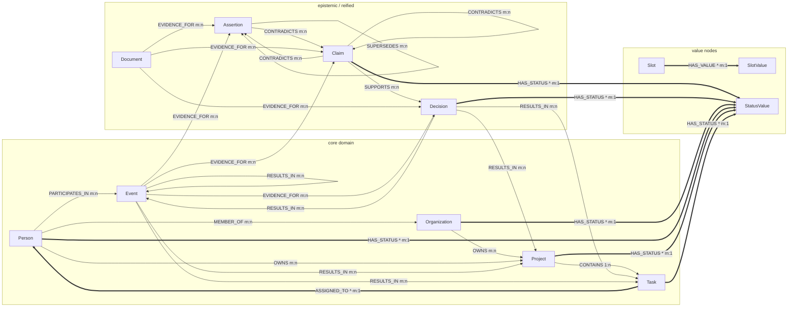

# OCMR typed graph

**Generated** by `python -m ocm.scripts.render_ontology_graph` from `ocm.ontology.relations.RELATION_SIGNATURES`. Do not edit by hand; re-run after any ontology change.

15 relations over 12 entity types, 68 fully expanded `(source, predicate, target)` type pairs.

Entity types are **nodes**; relations are **directed edges** keyed by predicate in a `networkx.MultiDiGraph` (`ocm/memory/graph_store.py`). Only `accepted` assertions become edges — superseded, quarantined and rejected assertions persist as rows in the repository but never appear in the graph.

## Diagram

Abridged: `ABOUT` (10 pairs), `POSSIBLY_SAME_AS` (25 pairs) are too wide to draw and appear in the fan-out table only.

`*` and thick arrows mark the single-valued relations. A second distinct object on the same subject is a contradiction **only** for these, so they are the only relations `durable_constraint_violations` can measure.

## Relations

| relation | cardinality | single-valued | sources | targets | pairs |
| --- | --- | :-: | --- | --- | --: |
| `PARTICIPATES_IN` | m:n | - | Person | Event | 1 |
| `MEMBER_OF` | m:n | - | Person | Organization | 1 |
| `OWNS` | m:n | - | Organization, Person | Project | 2 |
| `CONTAINS` | 1:n | - | Project | Task | 1 |
| `ASSIGNED_TO` | m:1 | **yes** | Task | Person | 1 |
| `PRECEDES` | m:n | - | Event | Event | 1 |
| `SUPPORTS` | m:n | - | Claim | Claim, Decision | 2 |
| `CONTRADICTS` | m:n | - | Assertion, Claim | Assertion, Claim | 4 |
| `EVIDENCE_FOR` | m:n | - | Document, Event | Assertion, Claim, Decision | 6 |
| `RESULTS_IN` | m:n | - | Decision, Event | Event, Project, Task | 6 |
| `ABOUT` | m:n | - | Claim, Document | Decision, Event, Person, Project, Task | 10 |
| `POSSIBLY_SAME_AS` | m:n | - | Event, Organization, Person, Project, Task | Event, Organization, Person, Project, Task | 25 |
| `SUPERSEDES` | m:n | - | Assertion | Assertion | 1 |
| `HAS_STATUS` | m:1 | **yes** | Claim, Decision, Organization, Person, Project, Task | StatusValue | 6 |
| `HAS_VALUE` | m:1 | **yes** | Slot | SlotValue | 1 |

Single-valued: **3 of 15** — `ASSIGNED_TO`, `HAS_STATUS`, `HAS_VALUE`.

## Entity types

- **core domain**: `Person`, `Organization`, `Project`, `Task`, `Event`
- **epistemic / reified**: `Claim`, `Decision`, `Document`, `Assertion`
- **value nodes**: `Slot`, `SlotValue`, `StatusValue`
